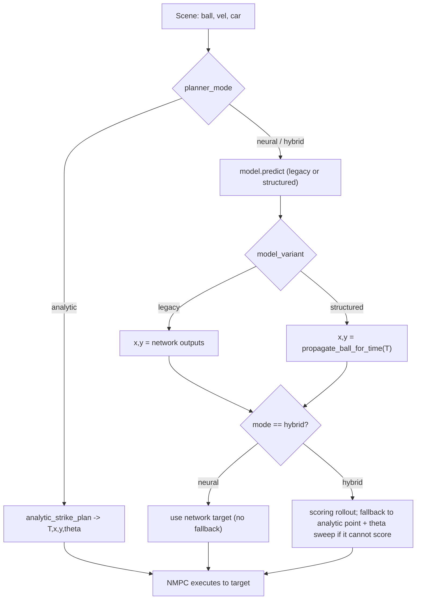

# Dual-Model + 3-Way Planner Comparison

## Goal and mental model

Two orthogonal axes:

- Model variant: `legacy` (5 outputs: `T, x, y, sin theta, cos theta`) and `structured` (3 outputs: `T, sin theta, cos theta`; strike `x,y` derived at runtime from `propagate_ball_for_time`).
- Planner mode: `analytic` (no network), `neural` (network only, no fallback), `hybrid` (network + scoring-guard fallback).

Runnable configs (the comparison harness runs all 5):
- `analytic` (model-independent)
- `neural_legacy`, `neural_structured`
- `hybrid_legacy`, `hybrid_structured`

Dataset: ONE shared `data/dataset/strike_dataset.npy` (R_turn stays 0.35). The structured model trains on the same file and simply ignores the `x,y` label columns. No dataset regeneration.



---

## Phase 1 - Paths and model storage

### Task 1.1 - `src/data_layout.py`
Add after the existing named-artifact block (around line 33):

```python
# --- Models (per variant) ---
MODELS_DIR = PROJECT_ROOT / "models"
STRIKE_NET_LEGACY = MODELS_DIR / "strategy_net_legacy.pth"
STRIKE_NET_STRUCTURED = MODELS_DIR / "strategy_net_structured.pth"
STRATEGY_NET_DEFAULT = MODELS_DIR / "strategy_net.pth"  # backward-compat (legacy)

TRAINING_LOG_LEGACY = TRAINING_DIR / "training_log_legacy.csv"
TRAINING_LOG_STRUCTURED = TRAINING_DIR / "training_log_structured.csv"

# --- Comparison harness ---
COMPARISON_TESTS_DIR = TESTS_DIR / "comparison"
PLOTS_COMPARISON_DIR = PLOTS_DIR / "comparison"

def model_path_for_variant(variant: str) -> Path:
    return STRIKE_NET_LEGACY if variant == "legacy" else STRIKE_NET_STRUCTURED

def training_log_for_variant(variant: str) -> Path:
    return TRAINING_LOG_LEGACY if variant == "legacy" else TRAINING_LOG_STRUCTURED

def new_comparison_run(run_id: str | None = None) -> Path:
    bid = run_id or timestamp_id()
    return ensure_dir(COMPARISON_TESTS_DIR / bid)

def plots_comparison_dir(run_id: str) -> Path:
    return ensure_dir(PLOTS_COMPARISON_DIR / run_id)
```

---

## Phase 2 - Dual-variant network ([src/network.py](src/network.py))

### Task 2.1 - Parameterize `StrikeNet` by variant
Replace the hardcoded 5-output constructor:

```python
class StrikeNet(nn.Module):
    def __init__(self, variant: str = "legacy"):
        super().__init__()
        assert variant in ("legacy", "structured")
        self.variant = variant
        out_dim = 5 if variant == "legacy" else 3   # legacy: T,x,y,sin,cos ; structured: T,sin,cos
        self.net = nn.Sequential(
            nn.Linear(7, 128), nn.ReLU(),
            nn.Linear(128, 128), nn.ReLU(),
            nn.Linear(128, 64), nn.ReLU(),
            nn.Linear(64, out_dim),
        )
        self.register_buffer('input_mean', torch.zeros(7))
        self.register_buffer('input_std', torch.ones(7))
        self.register_buffer('output_mean', torch.zeros(out_dim))
        self.register_buffer('output_std', torch.ones(out_dim))
```

`forward` is unchanged.

### Task 2.2 - Variant-aware `predict`
```python
def predict(self, x):
    self.eval()
    device = self.input_mean.device
    with torch.no_grad():
        if isinstance(x, np.ndarray):
            x = torch.tensor(x, dtype=torch.float32, device=device)
        else:
            x = x.to(device)
        if x.dim() == 1:
            x = x.unsqueeze(0)
        out = self(x) * (self.output_std + 1e-8) + self.output_mean
        T = out[:, 0].cpu().numpy()
        if self.variant == "legacy":
            x_s = out[:, 1].cpu().numpy(); y_s = out[:, 2].cpu().numpy()
            theta = np.arctan2(out[:, 3].cpu().numpy(), out[:, 4].cpu().numpy())
            preds = np.column_stack([T, x_s, y_s, theta])   # (N,4)
        else:
            theta = np.arctan2(out[:, 1].cpu().numpy(), out[:, 2].cpu().numpy())
            preds = np.column_stack([T, theta])             # (N,2)
        return preds[0] if preds.shape[0] == 1 else preds
```

### Task 2.3 - `StrikeNet.load` classmethod (auto-detect variant)
Add so existing `strategy_net.pth` (5-out) still loads as legacy:
```python
@classmethod
def load(cls, path, map_location="cpu"):
    sd = torch.load(path, map_location=map_location)
    out_dim = sd["output_mean"].numel()
    variant = "legacy" if out_dim == 5 else "structured"
    model = cls(variant=variant)
    model.load_state_dict(sd)
    model.eval()
    return model
```

### Task 2.4 - `train(variant=...)`
- Add `variant` parameter. Build targets:
  - legacy: `outputs_transformed = [T, x, y, sin(theta), cos(theta)]` (as today).
  - structured: `outputs_transformed = [T, sin(theta), cos(theta)]` (drop x,y).
- Instantiate `model = StrikeNet(variant=variant)`; everything else (normalization from train split, loss, early stopping, save) is unchanged but uses the variant-sized buffers automatically.
- Save to `model_path_for_variant(variant)` and log to `training_log_for_variant(variant)`.

### Task 2.5 - `__main__` trains both
Replace bottom block:
```python
if __name__ == "__main__":
    import argparse
    from src.data_layout import STRIKE_DATASET, model_path_for_variant, training_log_for_variant
    p = argparse.ArgumentParser()
    p.add_argument("--variant", choices=["legacy", "structured", "both"], default="both")
    a = p.parse_args()
    variants = ["legacy", "structured"] if a.variant == "both" else [a.variant]
    for v in variants:
        print(f"\n=== Training StrikeNet variant: {v} ===")
        train(str(STRIKE_DATASET), str(model_path_for_variant(v)),
              str(training_log_for_variant(v)), variant=v)
```
Note: training-loop target construction must branch on `model.output_mean.numel()` or pass `variant` through (the current loop slices `batch_y` and z-scores with `output_mean/std`; since buffers are now variant-sized and `outputs_transformed` matches, no other change is needed).

---

## Phase 3 - Inference and planner modes ([src/main.py](src/main.py))

### Task 3.1 - Extract a single decision function
Add a module-level helper that encapsulates ALL strike-target logic. This replaces the inline block currently at lines ~153-214.

```python
def decide_strike_target(planner_mode, model, model_variant, input7,
                         ball_start, ball_vel, car_state, goal,
                         dt, field_w, field_h, ball_restitution, v_impact):
    """Returns (T_final, x_tgt, y_tgt, theta_tgt, target_source, strike_pos, strike_vel)."""
    def goal_los(px, py):
        return np.arctan2(goal.center[1] - py, goal.center[0] - px)

    def scores(pos_xy, theta, svel):
        v_post = compute_strike_velocity(svel, v_car=v_impact, theta_car=theta, e_strike=0.8)
        fp, _ = propagate_ball_for_time(pos_xy, v_post, total_time=5.0, dt=dt,
                                        field_w=field_w, field_h=field_h,
                                        restitution=ball_restitution, goal=goal)
        return fp[0] >= goal.x - 1e-9 and goal.y_min <= fp[1] <= goal.y_max

    # ---------- ANALYTIC ----------
    if planner_mode == "analytic":
        plan = analytic_strike_plan(ball_start.copy(), ball_vel.copy(), car_state, goal,
                                    field_w=field_w, field_h=field_h,
                                    ball_dt=dt, ball_restitution=ball_restitution)
        if plan is None:
            T = 2.0
            sp, sv = propagate_ball_for_time(ball_start, ball_vel, T, dt=dt,
                                             field_w=field_w, field_h=field_h,
                                             restitution=ball_restitution)
            return T, float(sp[0]), float(sp[1]), goal_los(sp[0], sp[1]), "analytic_infeasible", sp, sv
        T, x, y, theta = plan
        sp, sv = propagate_ball_for_time(ball_start, ball_vel, T, dt=dt,
                                         field_w=field_w, field_h=field_h,
                                         restitution=ball_restitution)
        return float(T), float(x), float(y), float(theta), "analytic", sp, sv

    # ---------- NEURAL / HYBRID (model required) ----------
    preds = model.predict(input7)
    if model_variant == "legacy":
        T = float(preds[0]); x_net = float(preds[1]); y_net = float(preds[2]); theta_net = float(preds[3])
    else:
        T = float(preds[0]); theta_net = float(preds[1])

    N_steps = max(1, min(50, int(round(T / dt))))
    T_final = N_steps * dt
    sp, sv = propagate_ball_for_time(ball_start, ball_vel, T_final, dt=dt,
                                     field_w=field_w, field_h=field_h,
                                     restitution=ball_restitution)
    if model_variant == "structured":
        x_net, y_net = float(sp[0]), float(sp[1])     # on-trajectory by construction
    else:
        x_net = float(np.clip(x_net, 0.0, field_w)); y_net = float(np.clip(y_net, 0.0, field_h))

    if planner_mode == "neural":
        return T_final, x_net, y_net, theta_net, "network", sp, sv

    # hybrid
    if scores(np.array([x_net, y_net]), theta_net, sv):
        return T_final, x_net, y_net, theta_net, "network", sp, sv
    thetas = [t for t in np.linspace(-np.pi, np.pi, 36, endpoint=False) if scores(sp, t, sv)]
    if thetas:
        tg = goal_los(sp[0], sp[1])
        theta_fb = min(thetas, key=lambda th: abs(np.arctan2(np.sin(th - tg), np.cos(th - tg))))
    else:
        theta_fb = goal_los(sp[0], sp[1])
    return T_final, float(sp[0]), float(sp[1]), float(theta_fb), "fallback", sp, sv
```

### Task 3.2 - Rework `run_simulation` signature and body
- Add params: `planner_mode: str = "hybrid"`, `model_variant: str = "legacy"`.
- Model loading: only load when `planner_mode != "analytic"`. Resolve path via `model_path_for_variant(model_variant)` unless an explicit `model_path` is given. Use `StrikeNet.load(path)` and set `model_variant = model.variant` (trust the file).
- Replace the inline prediction/fallback block with a single call to `decide_strike_target(...)` returning `(T_final, x_strike_tgt, y_strike_tgt, theta_strike_tgt, target_source, strike_pos, strike_vel)`. Recompute `N_steps = round(T_final/dt)` (clamped) from the returned `T_final`.
- `net_vs_analytic`: keep only when a model is used; for analytic set to `0.0`.

### Task 3.3 - Latency fields (honest per-mode)
Keep the existing 30-rep harness but make it conditional and add deployed-path latency:
- Always measure `analytic_strategy_ms` (30-rep) for reference/speedup.
- If a model is used: measure `strikenet_infer_ms` (30-rep, CPU) as today.
- For structured: also measure `rollout_ms` (30-rep of `propagate_ball_for_time` to `T_final`).
- Add `decision_latency_ms`:
  - analytic -> `analytic_strategy_ms`
  - neural_legacy / hybrid_legacy -> `strikenet_infer_ms`
  - neural_structured / hybrid_structured -> `strikenet_infer_ms + rollout_ms`
- Wrap units in `max(..., 1e-6)` for any divisions (keep existing `speedup_factor`).

### Task 3.4 - Metadata additions
Add to the `meta` dict (keep all current fields incl. strike-gated `success`, `strike_point_pred_err_m`, etc.):
```python
"planner_mode": planner_mode,
"model_variant": (None if planner_mode == "analytic" else model_variant),
"decision_latency_ms": decision_latency_ms,
"rollout_ms": rollout_ms,           # None for legacy/analytic
```

### Task 3.5 - CLI
Add to the `__main__` argparser and pass through to `run_simulation`:
```python
parser.add_argument("--planner-mode", choices=["analytic","neural","hybrid"], default="hybrid")
parser.add_argument("--model-variant", choices=["legacy","structured"], default="legacy")
```

---

## Phase 4 - Per-seed batch runner ([scripts/test_main.py](scripts/test_main.py))

### Task 4.1 - New CLI args + passthrough
- Add `--planner-mode {analytic,neural,hybrid}` (default `hybrid`), `--model-variant {legacy,structured}` (default `legacy`), `--batch-dir <path>` (optional explicit output dir; when omitted use `new_integration_batch()`).
- In `_run_single_seed`, append to the subprocess `cmd`: `--planner-mode <mode>`; and when `mode != "analytic"`, `--model-variant <variant>`.

### Task 4.2 - Aggregate `summary.json`
After computing the summary block, write `summary.json` into the batch dir so the comparison harness can read it without re-parsing logs:
```python
summary = {
  "planner_mode": args.planner_mode,
  "model_variant": (None if args.planner_mode == "analytic" else args.model_variant),
  "n": len(seeds), "successes": successes, "success_rate": successes/len(seeds),
  "unstruck_goals": unstruck_goals,
  "mean_pred_err_m": float(mean_pred_err), "median_pred_err_m": float(median_pred_err),
  "mean_contact_dist_m": float(mean_contact),
  "net_episodes": net_total, "net_success": net_success,
  "fb_episodes": fb_total, "fb_success": fb_success,
}
json.dump(summary, open(Path(batch_dir)/"summary.json","w"), indent=2)
```
Also pull `decision_latency_ms` from each seed's metadata into a list and add `mean_decision_latency_ms` to the summary (read in `_run_single_seed`, return it, average in `main`).

### Task 4.3 - Source counting robustness
`net_total/fb_total` only increment on `target_source in {network, fallback}`. For analytic/neural batches these stay 0 (correct). No crash.

---

## Phase 5 - Comparison harness (NEW: `scripts/compare_modes.py`)

### Task 5.1 - Create the script
- `CONFIGS = [("analytic","analytic",None), ("neural_legacy","neural","legacy"), ("neural_structured","neural","structured"), ("hybrid_legacy","hybrid","legacy"), ("hybrid_structured","hybrid","structured")]`.
- Args: `--seeds` (default `range(100,200)`), `--no-video` (default true for speed), `--run-id`.
- Create `comp_dir = new_comparison_run(run_id)`. For each config, invoke `scripts/test_main.py` as a subprocess with:
  `--planner-mode <mode> [--model-variant <variant>] --no-video --batch-dir <comp_dir>/<name> --seeds <shared seeds>`.
- After all runs, read each `<comp_dir>/<name>/summary.json`.

### Task 5.2 - Combined outputs into `plots_comparison_dir(run_id)`
- `comparison.csv`: one row per config with success_rate, mean_pred_err_m, mean_decision_latency_ms, fallback share (`fb_episodes/n`, hybrid only), unstruck_goals.
- `comparison_summary.md`: human-readable bullet summary (NOT a tautology): highlight analytic vs neural_legacy vs neural_structured success gap, and whether structured closes the position-error gap (expect mean_pred_err ~0 for structured/analytic, larger for neural_legacy).
- `comparison_bars.png`: grouped bar charts - (a) success rate by config, (b) mean strike pred error by config, (c) mean decision latency (log scale) by config.
- Print a final ASCII table to stdout.

### Task 5.3 - Guard
If a required model file is missing (e.g. `strategy_net_structured.pth`), print a clear message ("train it first: `python -m src.network --variant structured`") and skip that config rather than crashing.

---

## Phase 6 - Supporting scripts

### Task 6.1 - `scripts/test_network.py`
- Add `--variant {legacy,structured,both}` (default `both`).
- Load via `StrikeNet.load(model_path_for_variant(v))`.
- For legacy keep T/pos/heading errors. For structured report only T and heading errors (preds have shape (N,2); there is no x,y to compare). Guard the slicing accordingly.

### Task 6.2 - `scripts/benchmark_scalability.py`
- Add `--model-variant {legacy,structured,both}` (default `both`).
- Load each variant via `StrikeNet.load(...)`.
- Network latency per variant: legacy = inference; structured = inference + one `propagate_ball_for_time` rollout (to a representative T, e.g. 2.0 s) so the curve reflects the true deployed structured decision cost.
- Plot: analytic curve (vs n_angles) plus one flat line per included variant. Update CSV columns to include `variant`.

### Task 6.3 - `scripts/analyze_results.py` and `scripts/analyze_fallback.py`
- `analyze_results.py`: read `planner_mode`/`model_variant` from metadata; include them in `research_summary.md` header and the CSV. No metric math changes.
- `analyze_fallback.py`: if the batch has zero `network`/`fallback` rows (i.e. analytic or neural batch), print "fallback analysis not applicable for mode=<...>" and exit 0 instead of dividing by zero.

---

## Phase 7 - Pipeline + docs

### Task 7.1 - `run_pipeline.ps1`, `run_pipeline.sh`, `RUN_COMMANDS.txt`
- Step 2 (train): `python -m src.network --variant both` (writes both model files).
- Step 3 (sanity): `python scripts/test_network.py --variant both`.
- Add a new step after analysis: `python scripts/compare_modes.py --no-video` (the 5-way comparison).
- Keep Step 4 integration default as hybrid_legacy for continuity; mention the new flags.

### Task 7.2 - Docs
- Update [docs/FUTURE_physics_informed_prediction.md](docs/FUTURE_physics_informed_prediction.md): change status to "implemented as the `structured` variant"; point to `compare_modes.py`.
- Add a short section to [docs/SYSTEM_OVERVIEW.md](docs/SYSTEM_OVERVIEW.md) and [docs/PIPELINE_LOGIC.md](docs/PIPELINE_LOGIC.md) describing the two model variants, the three planner modes, and the comparison harness. Update [docs/DATA_AND_REPORTS.md](docs/DATA_AND_REPORTS.md) with the new metadata fields (`planner_mode`, `model_variant`, `decision_latency_ms`, `rollout_ms`) and the `data/tests/comparison/` + `data/reports/plots/comparison/` layout.

---

## Verification (after implementation)

```powershell
conda activate striker
python -m src.network --variant both
python scripts/test_network.py --variant both
python scripts/compare_modes.py --no-video --seeds 100 101 102 103 104
```
Expected: structured + analytic configs show mean strike pred error ~0; `neural_legacy` shows a larger pred error; `comparison_summary.md`, `comparison.csv`, `comparison_bars.png` written under `data/reports/plots/comparison/<run_id>/`.

## Backward compatibility notes
- `StrikeNet.load` auto-detects variant from `output_mean` length, so the existing `models/strategy_net.pth` (5-out) keeps working as legacy.
- The shared dataset is unchanged; the structured model ignores `x,y` columns at train time. No regen. R_turn stays 0.35 in `src/planner.py` for clean A/B parity.
