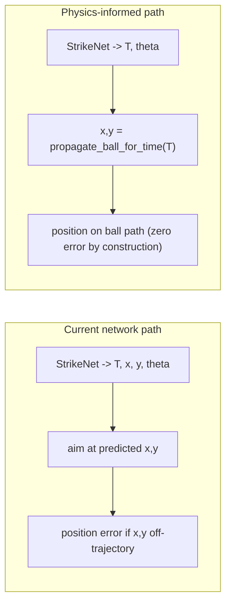

# Future Work: Physics-Informed (Structured) Strike Prediction

Status: proposed, not yet implemented.
Owner: TBD.
Depends on: a dataset regeneration + StrikeNet retrain (so it pairs naturally with
the "exact `R_min`" change deferred from Issue 3 of the evaluation-validity fixes).

---

## 1. Problem this solves

Today StrikeNet predicts four targets independently:

```
StrikeNet(ball_x, ball_y, ball_vx, ball_vy, car_x, car_y, car_theta)
    -> (T_s, x_s, y_s, theta_s)
```

Because `(x_s, y_s)` is predicted *independently* of `T_s`, the network must
implicitly memorize the ball physics: it has to learn, for every scene, exactly
where the bouncing ball will be at time `T_s`. If the predicted position is off
by even a few centimeters, the car aims at a point the ball never actually
occupies at `T_s`. This is a structural error mode, not a tuning issue.

Empirically this is the measured bottleneck. From the latest batch
(`20260612_220424`, see `data/reports/plots/integration/<batch>/fallback_summary.md`):

- Network-trusted episodes: success rate ~67.3%, mean strike position error ~0.30 m.
- Analytic fallback episodes: success rate ~82.2%, mean strike position error ~0.36 m
  (but position lies exactly on the ball path by construction).
- The fallback summary explicitly notes: "A large gap in favour of the fallback
  indicates the network's *position* prediction is still the accuracy bottleneck."

So the network is losing accuracy precisely on the quantity that can be derived
exactly from known physics.

---

## 2. The idea: predict strategy, derive geometry

Change StrikeNet to output only the macroscopic strategy:

```
StrikeNet(...) -> (T_s, theta_s)        # theta encoded as (sin, cos) -> 3 outputs
```

Derive the spatial interception target analytically at runtime by rolling the
ball forward to `T_s` with the known, deterministic bounce model that already
exists in [src/ball_physics.py](../src/ball_physics.py):

```python
x_s, y_s = propagate_ball_for_time(ball_start, ball_vel, T_s,
                                   dt=dt, field_w=W, field_h=H,
                                   restitution=ball_restitution)
```

### Why this is principled

- The positional error becomes **zero by construction**: the car always targets a
  point that lies exactly on the ball's true trajectory. This is the same thing
  the analytic planner already does, and is why the analytic fallback has the
  better success rate.
- The network only has to learn the *decision* (when to strike, `T_s`, and which
  redirect heading, `theta_s`), not a regression of the physics. Lower output
  dimensionality (5 -> 3) and a smoother target should train faster and
  generalize better, especially out-of-distribution.



---

## 3. What this does NOT fix (be precise when reporting)

- Scoring still depends on `theta_s` (the redirect heading) being correct and on
  `T_s` being reachable/accurate. Physics-informed prediction removes the
  *position* error mode only. If heading prediction is the real limiter for some
  scenes, the gain will be partial.
- The "push pure-network success to >= 80%, drop the fallback, and claim the full
  1748x speedup safely" outcome is **plausible but must be verified empirically**,
  not assumed.

---

## 4. Latency honesty

After this change the deployed network decision costs:

```
network inference (~0.166 ms)  +  one ball rollout to a single T_s (sub-ms)
```

versus the analytic search's full `T`-sweep x `theta`-sweep (~352 ms at
n_angles=36). There is no longer a runtime `theta`-sweep on the trusted path.
Report decision latency as `inference + single rollout` (still hundreds-to-
thousands x faster), not inference-only. If the fallback is retained, also report
its share and its true runtime cost.

---

## 5. Implementation scope

### 5.1 Network ([src/network.py](../src/network.py))
- Output dim 5 -> 3. Outputs become `[T, sin(theta), cos(theta)]`.
- Drop `x_s, y_s` from the transformed targets and from `output_mean/output_std`
  normalization buffers (now length 3).
- `predict()` returns `(T, theta)` (reconstruct theta via `arctan2(sin, cos)`).
- Retrain; note the MSE scale changes again (targets differ), so loss values are
  not comparable to prior runs.

### 5.2 Inference ([src/main.py](../src/main.py))
- The physics-rolled point is **already computed** today as `strike_pos` via
  `propagate_ball_for_time(ball_start, ball_vel, T_final, ...)` (around lines
  157-166) but the network path ignores it in favor of the raw `x_strike_net,
  y_strike_net`. The change is essentially:
  - network path: set `x_strike_tgt, y_strike_tgt = strike_pos[0], strike_pos[1]`
    (instead of the clipped network x/y).
  - keep the scoring / fallback check, but now it tests only whether `theta_strike`
    sends the on-trajectory ball into the goal.
- Remove `x_strike`, `y_strike` consumption from the prediction unpacking; keep
  `T_strike` and `theta_strike`.

### 5.3 Dataset ([src/data_generator.py](../src/data_generator.py))
- Optional but recommended: the labels can keep emitting `(T, x, y, theta)` (the
  network simply ignores x/y at train time), OR be trimmed to `(T, theta)`. If
  trimming, update `src/data_layout.py` column expectations and any consumers.
- Good moment to fold in the exact turn radius `R_min = L / tan(delta_max) = 0.30`
  deferred from Issue 3, since a regen+retrain is happening anyway.

### 5.4 Evaluation
- Add / use a "pure network, no fallback" mode so the network is measured on its
  own (the current pipeline masks network weaknesses behind the analytic fallback).
- Re-run the integration batch; report pure-network success, combined decision
  latency, and the network-vs-fallback breakdown.

---

## 6. Acceptance criteria

- Network-path mean strike *position* error is ~0 (sanity: equals the analytic
  path, since both now sit on the ball trajectory).
- Pure-network (no-fallback) goal success rate measured and reported.
- Fallback engagement share drops materially; if it approaches ~0, the
  inference-only/inference+rollout speedup can be claimed for the deployed system.
- Out-of-distribution check (different field size / restitution / ball-speed
  range) shows the structured model generalizing at least as well as the current
  one.
