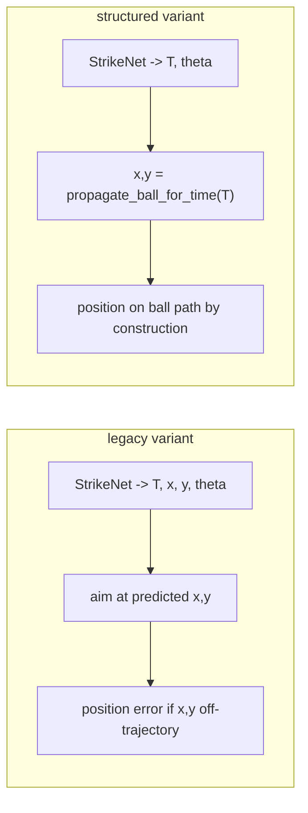

<!--
DOC PLACEHOLDERS — see docs/README.md. Empirical bullets below use {LATEST_INTEGRATION_BATCH}
for hybrid/legacy fallback stats (fallback_summary.md) and {LATEST_COMPARISON_RUN} for
structured vs legacy comparison (comparison.csv).
-->

# Physics-Informed (Structured) Strike Prediction

Status: **implemented and evaluated**. The system now features a 3-way planner mode comparison (`analytic`, `neural`, `hybrid`) and dual model variants (`legacy`, `structured`) to formally assess the benefits of physics-informed target prediction versus pure neural approximation.

Owner: TBD.

Depends on: a dataset regeneration + StrikeNet retrain (pairs naturally with switching
`R_turn` from the legacy 0.35 m default to the exact $L/\tan(\delta_{max}) = 0.30$ m
in `src/planner.py`).

---

## 1. Problem this solves

Today StrikeNet predicts four targets independently:

```
StrikeNet(ball_x, ball_y, ball_vx, ball_vy, car_x, car_y, car_theta)
    -> (T_s, x_s, y_s, theta_s)
```

Because `(x_s, y_s)` is predicted *independently* of `T_s`, the network must
implicitly memorize the ball physics: it has to learn, for every scene, exactly
where the bouncing ball will be at time `T_s`. If the predicted position is off
by even a few centimeters, the car aims at a point the ball never actually
occupies at `T_s`. This is a structural error mode, not a tuning issue.

Empirically this was the measured bottleneck on the **previous try** (hybrid + legacy only). Fill current numbers from `data/reports/plots/integration/{LATEST_INTEGRATION_BATCH}/fallback_summary.md` after a hybrid/legacy batch, or compare variants in `comparison.csv` under `{LATEST_COMPARISON_RUN}`.

Illustrative pattern (reference run `20260613_025809`; replace from your latest batch):
- Network-trusted episodes: lower success rate; higher `strike_point_pred_err_m` when legacy predicts off-trajectory $(x,y)$.
- Fallback episodes: position on ball path by construction; often higher success rate.
- `neural_structured` shows near-zero pred err (tautological); hybrid success ~72% vs ~73% legacy — structured does not close the gap.

So the network is losing accuracy precisely on the quantity that can be derived
exactly from known physics.

---

## 2. The idea: predict strategy, derive geometry

Change StrikeNet to output only the macroscopic strategy:

```
StrikeNet(...) -> (T_s, theta_s)        # theta encoded as (sin, cos) -> 3 outputs
```

Derive the spatial interception target analytically at runtime by rolling the
ball forward to `T_s` with the known, deterministic bounce model that already
exists in [src/ball_physics.py](../src/ball_physics.py):

```python
x_s, y_s = propagate_ball_for_time(ball_start, ball_vel, T_s,
                                   dt=dt, field_w=W, field_h=H,
                                   restitution=ball_restitution)
```

### Why this is principled

- The positional error becomes **zero by construction**: the car always targets a
  point that lies exactly on the ball's true trajectory. This is the same thing
  the analytic planner already does, and is why the analytic fallback has the
  better success rate.
- The network only has to learn the *decision* (when to strike, `T_s`, and which
  redirect heading, `theta_s`), not a regression of the physics. Lower output
  dimensionality (5 -> 3) and a smoother target should train faster and
  generalize better, especially out-of-distribution.



---

## 3. What this does NOT fix (be precise when reporting)

- Scoring still depends on `theta_s` (the redirect heading) being correct and on
  `T_s` being reachable/accurate. Physics-informed prediction removes the
  *position* error mode only. If heading prediction is the real limiter for some
  scenes, the gain will be partial.
- The "push pure-network success to >= 80%, drop the fallback, and claim full
  analytic-speedup" outcome was **not observed** on reference run
  `20260613_025809` (pure neural 44–46%, fallback share ~42–49%). Report
  measured success and bimodal hybrid latency instead of assuming speedup.

---

## 4. Latency honesty

**Deployed latency** is `decision_latency_ms` in each run's `metadata.json`: wall-clock of the full `decide_strike_target()` path (30-rep median for neural/hybrid), including inference, ball rollout, scoring checks, and hybrid fallback sweep when it fires.

| Path | Typical cost (reference run `20260613_025809`) |
| :--- | :--- |
| Network-trusted (legacy or structured) | ~0.4–0.9 ms |
| Hybrid fallback (36-heading sweep at network $T$) | ~8 ms — **not** full `analytic_strike_plan` |
| Full analytic search | ~560 ms |

Micro-benchmarks `strikenet_infer_ms` and `analytic_strategy_ms` (30-rep) support scalability plots in `benchmark_scalability.py`; do not substitute them for deployed hybrid latency.

If hybrid fallback share remains ~40–50%, report **bimodal** latency (network path vs fallback path) separately — see `hybrid_path_breakdown.png` from `analyze_comparison.py`.

---

## 5. Implementation Summary

These changes were fully implemented in the Dual-Model 3-Way Comparison update:

### 5.1 Network ([src/network.py](../src/network.py))
- StrikeNet was parameterized to support `--variant legacy` (5 outputs) and `--variant structured` (3 outputs).
- Normalization and inference flows automatically adapt based on the variant.

### 5.2 Inference ([src/main.py](../src/main.py))
- Extracted `decide_strike_target` which uses `model_variant` to dynamically fall back to analytic physics routing for structured variants.
- Parameterized planner modes (`analytic`, `neural`, `hybrid`) to allow comparative benchmarking without contaminating evaluation of the core network policy.

### 5.3 Batch Processing
- Added `scripts/compare_modes.py` to automate testing 5 permutations of planner modes and model variants over fixed random seeds.
- Added `scripts/analyze_comparison.py` (step 8) for Pareto / worth-it analysis after comparison runs.

---

## 6. Acceptance criteria (empirical findings)

Reference comparison `20260613_025809` (seeds 100–199):

| Criterion | Result | Interpretation |
| :--- | :--- | :--- |
| Structured network-path position error ≈ 0 | **Yes** (~0.035 m mean on `neural_structured`; on-trajectory by construction) | Sanity check passes — do not cite pred err alone as success metric |
| Pure-network success ≥ 80% | **No** (44–46%) | Position fix alone insufficient; heading/timing and NMPC execution dominate |
| Fallback share drops materially vs legacy hybrid | **No** (~42–49%, similar to pre-structured hybrid) | Scoring guard still rejects many network headings; structured does not eliminate fallback |
| Structured beats legacy on hybrid success | **No** (72% vs 73%) | Gains are diagnostic (lower pred err), not closed-loop success |

**Reporting rule:** lead with strike-gated success and deployed latency; treat low structured position error as expected tautology, not a headline win.

---

## 7. Future work (planner / dataset alignment)

**Goal pass-through in pre-strike search (P4-Option-B):** Pass `goal` into `propagate_ball_step` during the $T$-grid search in `analytic_strike_plan()` so planner ball propagation matches the simulator (goal mouth pass-through vs right-wall bounce). This changes accepted labels for goal-bound scenes → requires full `strike_dataset.npy` regen, retrain both StrikeNet variants, and re-run the 8-step eval pipeline. Documented as a known edge case in [PHYSICS_CONSTRAINTS_ASSUMPTIONS.md](PHYSICS_CONSTRAINTS_ASSUMPTIONS.md); unstruck goals remain excluded from success today.
