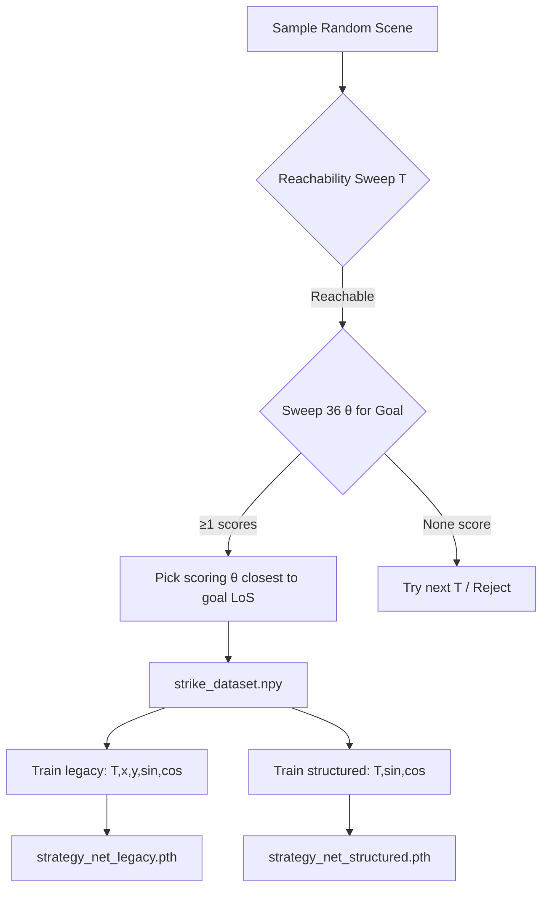
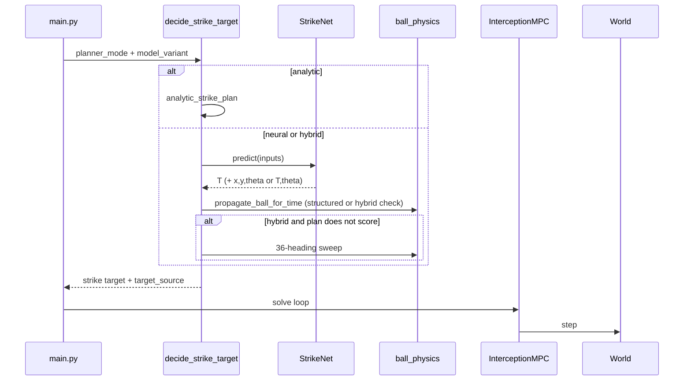

<!--
DOC PLACEHOLDERS — see docs/README.md for token definitions and how to resolve them.
-->

# Pipeline Logic — Phase 5 Striker

## Offline pipeline: data to models



### 1. Data generation (`python -m src.data_generator`)

Label search is in `src/planner.py` as `analytic_strike_plan()`. Reachability uses `max_reach_distance(T)` with $a_{max}=2.0$ m/s², $v_{max}=2.0$ m/s, and turn-arc penalty $R_{turn}=0.35$ m (legacy default; exact $0.30$ m deferred — see [PHYSICS_INFORMED_PREDICTION.md](PHYSICS_INFORMED_PREDICTION.md)).

Per sample:
1. Random ball and car state.
2. For $T \in [0.5, 5.0]$ s (step $0.05$ s): propagate ball, sweep 36 headings, keep scoring **and** reachable candidates.
3. First feasible $T$; canonical heading = closest to goal line-of-sight.
4. Save 11 columns: `[ball_x, ball_y, ball_vx, ball_vy, car_x, car_y, car_theta, T, x, y, theta]`.

### 2. Training (`python -m src.network --variant {legacy|structured|both}`)

| Variant | Training targets | Checkpoint | Log |
| :--- | :--- | :--- | :--- |
| `legacy` | $[T, x, y, \sin\theta, \cos\theta]$ | `models/strategy_net_legacy.pth` | `data/training/training_log_legacy.csv` |
| `structured` | $[T, \sin\theta, \cos\theta]$ | `models/strategy_net_structured.pth` | `data/training/training_log_structured.csv` |

* Architecture: `Input(7) → 128 → 128 → 64 → Output(5 or 3)`.
* Z-scored input and output (train-split statistics in registered buffers).
* MSE in normalized space; early stopping (patience 20).

---

## Online loop: `decide_strike_target()` + two-phase execution

Entry point: `run_simulation(planner_mode, model_variant, ...)` in `src/main.py`.

### Strike target selection

```
decide_strike_target(planner_mode, model, model_variant, input7, ...)
```

| Mode | Logic |
| :--- | :--- |
| **analytic** | `analytic_strike_plan()` → $(T, x, y, \theta)$. If infeasible: ball at $T=2$s fallback. |
| **neural** | `model.predict()` → use prediction directly (`target_source = "network"`). |
| **hybrid** | Predict → scoring rollout; if pass use network, else **36-heading sweep** at network $T$ and propagated ball position (`target_source = "fallback"`). This fallback is **not** full `analytic_strike_plan` (~8 ms vs ~560 ms). |

**Structured variant:** after predicting $(T, \theta)$, $x,y$ come from `propagate_ball_for_time` to $T_{final}$ — not from the network.

**Legacy variant:** $(x, y)$ predicted and clipped to field; `net_vs_analytic_pos_m` logged when `target_source == "network"`.

### Phase 1: NMPC interception

1. $N_{steps} = \mathrm{clip}(\mathrm{round}(T / \Delta t), 1, 50)$.
2. Offset target: $\mathbf{q}_{strike} = [x - 0.32\cos\theta,\ y - 0.32\sin\theta,\ \theta,\ v_{impact}]$.
3. Shrinking-horizon `InterceptionMPC` until contact (`dist < 0.35$ m) or horizon exhausted.

### Phase 2: Post-strike

Up to 80 steps with active braking; early exit on `scored`.



### Latency metadata

Per run, `metadata.json` records:

| Field | Meaning |
| :--- | :--- |
| **`decision_latency_ms`** | **Deployed path** — wall-clock of `decide_strike_target()` (30-rep median for neural/hybrid; analytic reuses `analytic_strategy_ms`). Includes inference, rollout, scoring checks, and hybrid fallback sweep when it fires. |
| **`fallback_sweep_ms`** | Hybrid only: time in the 36-heading sweep when `target_source = "fallback"`. |
| **`infer_plus_rollout_ms`** | Neural/structured: inference + single ball rollout (diagnostic). |
| **`strikenet_infer_ms`**, **`analytic_strategy_ms`** | 30-rep micro-benchmarks for scalability — not the headline deployed latency unless mode is pure analytic. |
| **`planner_mode`**, **`model_variant`** | Config tags for comparison grouping. |

`summary.json` adds batch-level `mean_decision_latency_ms`, `median_decision_latency_ms`, and path-specific medians when available.

---

## Testing and reporting pipelines

### Integration test (`scripts/test_main.py`)

```powershell
python scripts/test_main.py --planner-mode hybrid --model-variant legacy
python scripts/test_main.py --planner-mode analytic --no-video
```

* Default: 100 seeds (100–199), hybrid + legacy.
* Writes `summary.json` per batch (success rate, `mean_pred_err_m`, `mean_decision_latency_ms`, network/fallback counts).
* **Pass:** strike-gated success $\ge 60\%$.

### Comparison harness (`scripts/compare_modes.py`)

Runs five configs on shared seeds (videos off by default):

| Config folder | Mode | Variant |
| :--- | :--- | :--- |
| `analytic` | analytic | — |
| `neural_legacy` | neural | legacy |
| `neural_structured` | neural | structured |
| `hybrid_legacy` | hybrid | legacy |
| `hybrid_structured` | hybrid | structured |

Outputs under `data/tests/comparison/{LATEST_COMPARISON_RUN}/` and `data/reports/plots/comparison/{run}/`.

**Step 8 — cost/benefit analysis** (`python -m scripts.analyze_comparison`): reads comparison metadata and writes `worth_it_summary.md`, Pareto/latency/heatmap plots, `config_summary.csv`, `win_matrix.csv`, etc. Run automatically after step 7 in `run_pipeline.ps1` / `.sh`.

### Other scripts

| Script | Role |
| :--- | :--- |
| `scripts/generate_plots.py` | Per-batch trajectory/error plots |
| `scripts/analyze_results.py` | `research_summary.md`; deployed latency plot |
| `scripts/analyze_fallback.py` | Hybrid-only network vs fallback (graceful skip otherwise) |
| `scripts/analyze_comparison.py` | Cross-config cost/benefit after `compare_modes.py` |
| `scripts/benchmark_scalability.py` | Analytic vs network; hybrid fallback sweep; `--model-variant both` |
| `scripts/summarize_pipeline.py` | One-page rollup after full or partial pipeline |
| `scripts/test_network.py` | Sanity check both variants on dataset samples |

### Full pipeline (`run_pipeline.ps1` / `run_pipeline.sh`)

1. Data generation  
2. Train both variants (`--variant both`)  
3. Network sanity check  
4. Integration test (hybrid/legacy, optional `-NoVideo`)  
5. Plots + `analyze_results` + `analyze_fallback`  
6. Scalability benchmark (light by default: 50 scenes × 10 reps; `-FullBench` for full sweep)  
7. `compare_modes.py` — five configs on shared seeds  
8. `analyze_comparison.py` — worth-it / Pareto analysis  
9. `summarize_pipeline.py --save` (automatic, non-fatal if partial)
