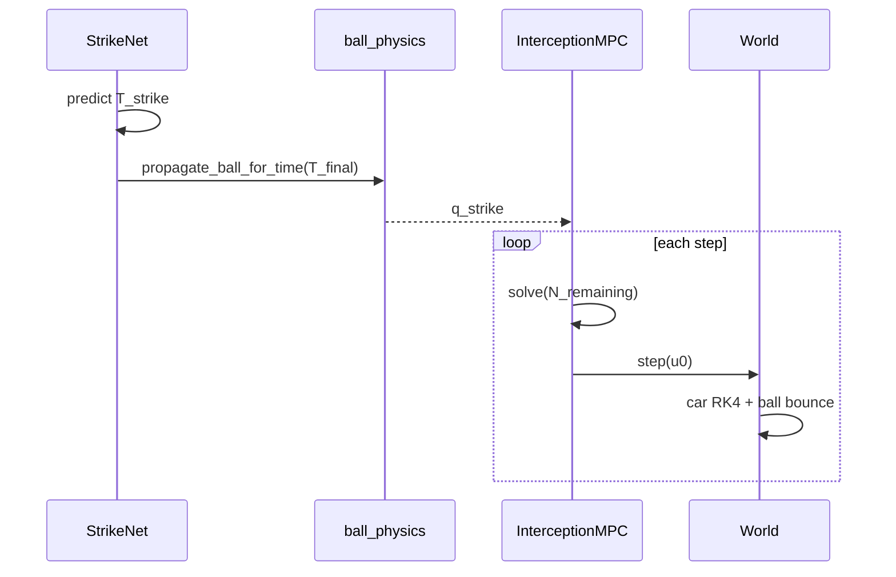

# Pipeline logic

## Offline: dataset → StrikeNet

### 1. Data generation (`python -m src.data_generator`)

For each accepted sample:

1. Draw random ball and car initial conditions (see [PHYSICS_CONSTRAINTS_ASSUMPTIONS.md](PHYSICS_CONSTRAINTS_ASSUMPTIONS.md)).
2. For increasing time `T`, integrate ball with `propagate_ball_step` (incremental, same as simulator).
3. Stop at the **smallest** `T` where:
   - ball at `T` is **on the field**, and
   - car can reach that point under the bi-arc + `d_max(T)` model.
4. Store row:  
   `[b_x, b_y, b_vx, b_vy, c_x, c_y, c_θ, T, x_strike, y_strike, θ_strike]`.

Output: `data/dataset/strike_dataset.npy`, shape `(N, 11)`.

### 2. Training (`python -m src.network`)

- MLP **StrikeNet**: 7 inputs → 4 outputs.
- Loss: MSE on all outputs (normalized internally during training).
- Logs: `data/training/training_log.csv`.
- Weights: `models/strategy_net.pth` (GPU if CUDA available).

**Assumption:** Imitation learning from geometric labels is sufficient; no RL in the loop.

---

## Online: one interception run (`run_simulation` in `main.py`)

### Step A — StrikeNet inference

```text
inputs = [ball_x, ball_y, ball_vx, ball_vy, car_x, car_y, car_theta]
preds  = model.predict(inputs)  → [T_strike, x_pred, y_pred, theta_pred]
N_steps = clip(round(T_strike / dt), 1, 50)
T_final = N_steps * dt
```

`x_pred, y_pred` are printed for debugging; **MPC does not use them as the terminal position.**

### Step B — Bounce-correct strike target

```text
strike_pos = propagate_ball_for_time(ball_start, ball_vel, T_final, ...)
theta_strike = atan2(goal_y - strike_pos.y, goal_x - strike_pos.x)
q_strike = [strike_pos.x, strike_pos.y, theta_strike, v_impact]
```

This matches training physics: terminal NMPC state is where the ball **will be** at `T_final` given bounces.

### Step C — Shrinking-horizon NMPC

For `step = 0 .. N_steps-1`:

```text
N_remaining = N_steps - step
u0 = mpc.solve(car_state, q_strike, N_remaining)
world.step(u0)
```

- Horizon **shrinks** each step (`N_remaining` decreases).
- Terminal cost always targets the **same** `q_strike` (fixed intercept pose).
- Errors logged each step:
  - `pos_err` = ‖car_xy − ball_xy‖
  - `heading_err` = |wrap(car_θ − theta_strike)|

### Step D — Success

After the last step:

- `success` if `pos_err ≤ 0.2` and `heading_err ≤ 0.15`.
- If `run_dir` set: write `trajectory.csv`, optional `simulation.mp4`, `metadata.json`.



---

## Integration test logic (`scripts/test_main.py`)

1. Create batch folder `data/tests/integration/{YYYYMMDD_HHMMSS}/`.
2. For each seed in `DEFAULT_INTEGRATION_SEEDS` (10 seeds):
   - `np.random.seed(seed)`, `torch.manual_seed(seed)`.
   - Regenerate ball/car initial conditions (same distributions as `main.py`).
   - `run_simulation(..., run_dir=.../seed_{N}/, save_video=True)`.
3. Aggregate pass/fail; write `batch.log`.

**Consistency check:** metadata `strike_target` must equal `propagate_ball_for_time` at `T_final` (test helper `check_bounce_target_consistency`).

---

## Report plots logic (`scripts/generate_plots.py`)

Plots are **not** mixed in one flat folder anymore:

```text
data/reports/plots/
  README.md
  global/
    training_curve.png
    strikenet_sample_errors.png
  integration/{batch_id}/
    README.md              ← links to data/tests/integration/{batch_id}/
    integration_summary.png
    seed_{N}/
      trajectory.png
      errors.png
```

- **`--batch`** selects the integration run; default = latest batch under `data/tests/integration/`.
- Each `seed_{N}/` under plots corresponds to the **same** `seed_{N}/` under `data/tests/integration/{batch_id}/` (source CSV/video/metadata).

See [DATA_AND_REPORTS.md](DATA_AND_REPORTS.md).

---

## Static target test (`scripts/test_static_target.py`)

Sanity check with a **fixed** strike pose (no StrikeNet). Verifies NMPC + simulator alone. Outputs under `data/tests/static/{batch}/`.

---

## Mental model: what must stay aligned

| Quantity | Must match across |
|----------|-------------------|
| `dt` | `World`, `InterceptionMPC`, `ball_physics`, `main.py` |
| `field_w`, `field_h` | generator, simulator, main, tests |
| `restitution` | generator, simulator, main, tests |
| Initial state sampling | `main.py`, `test_main.py` |
| Ball integrator | `data_generator`, `ball_physics`, `World.step` |

If any of these diverge, StrikeNet labels and runtime targets will disagree and intercepts will miss or leave the field.
