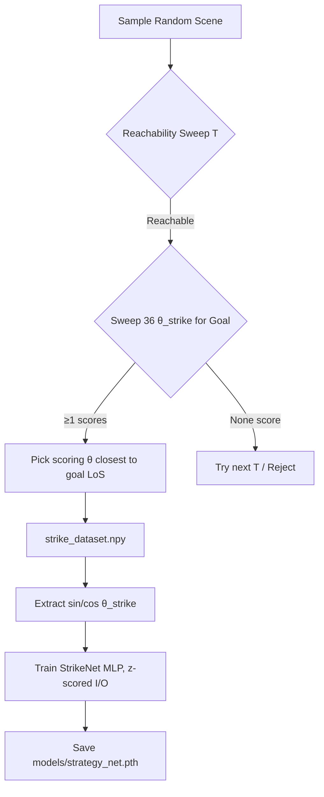
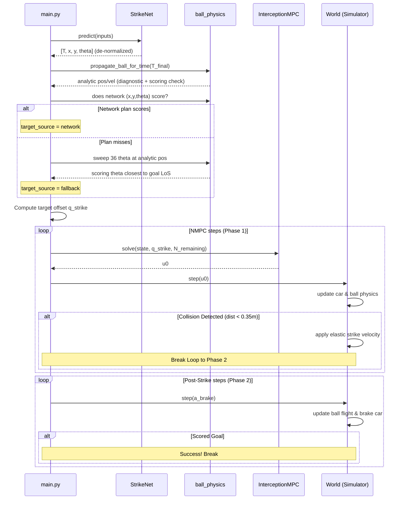

# Pipeline Logic — Phase 5 Striker

## 🖥️ Offline Pipeline: Data to Model

### 1. Data Generation (`python -m src.data_generator`)

Label search is implemented in `src/planner.py` as `analytic_strike_plan()` (also called by `main.py` for fallback timing and `benchmark_scalability.py`). Reachability uses `max_reach_distance(T)` with car constants matching NMPC ($a_{max}=2.0$ m/s², $v_{max}=2.0$ m/s) and a turn-arc penalty with $R_{turn}=0.35$ m (legacy default; exact value $L/\tan(\delta_{max})=0.30$ m is deferred to a future dataset regen — see [FUTURE_physics_informed_prediction.md](FUTURE_physics_informed_prediction.md)).

For each sample scene:
1. Initialize random ball and car parameters.
2. For increasing $T \in [0.5, 5.0]$ s (in steps of $0.05$ s):
   - Propagate ball position $\mathbf{p}_b(T)$ using the shared bounce integrator.
   - Sweep $\theta_{strike} \in [-\pi, \pi]$ (36 candidates). For each candidate, compute post-collision ball velocity $\mathbf{v}_{ball}^{post}$ with $v_{impact} = 1.0$ m/s, propagate for 5.0 s, and check both that it crosses the goal mouth **and** that the strike orientation is reachable by the car in time $T$ (kinodynamic distance check).
   - Collect **all** candidates that are simultaneously scoring and reachable.
3. The first $T$ with at least one feasible candidate is chosen. Among the feasible candidates, the **canonical label** is the heading closest to the line-of-sight from the strike point to the goal center:
   $$\theta_{strike} = \arg\min_{\theta \in \text{feasible}} \left| \text{wrap}(\theta - \theta_{LoS \to goal}) \right|$$
   This deterministic, approximately-continuous selection replaces the earlier "first scoring angle from $-\pi$" rule, which produced a discontinuous, multimodal target that MSE regression averages into invalid in-between headings.
4. Save raw labels: `[ball_x, ball_y, ball_vx, ball_vy, car_x, car_y, car_theta, T_strike, x_strike, y_strike, theta_strike]`.

### 2. Training Transformation (`python -m src.network`)
To avoid discontinuities when mapping angular headings near $\pm\pi$, the training loop transforms $\theta_{strike}$ into sine and cosine components:
$$\mathbf{y}_{train} = [T_{strike}, x_{strike}, y_{strike}, \sin(\theta_{strike}), \cos(\theta_{strike})]$$
* **Architecture**: Multi-Layer Perceptron (MLP) with layer sizes `Input(7) -> 128 -> 128 -> 64 -> Output(5)`.
* **Input normalization**: per-feature z-scoring using mean/std computed on the training split, stored as registered buffers (`input_mean`, `input_std`).
* **Output normalization**: the 5 targets are **also** z-scored (`output_mean`, `output_std`, from the training split). Without this, the raw scales differ by ~5–10× (e.g. $x \in [0,10]$ vs $\sin\theta \in [-1,1]$), so the MSE would be dominated by $T, x, y$ and barely train the heading. `predict()` de-normalizes the network output back to physical units before reconstructing $\theta = \text{arctan2}(\sin, \cos)$.
* **Loss**: Mean Squared Error (MSE) computed across all 5 outputs **in normalized space**.

---

## 🏃 Online Loop: Two-Phase Execution (`main.py`)

### Phase 1: NMPC Interception
1. **StrikeNet Inference**: Maps the initial 7-D scene configuration to predicted values (outputs are de-normalized inside `predict()`):
   $$\text{preds} = [T_{strike}, x_{strike}, y_{strike}, \theta_{strike}], \quad \theta_{strike} = \text{arctan2}(\sin, \cos)$$
2. **Horizon Steps**: Calculate discrete steps: $N_{steps} = \text{clip}(\text{round}(T_{strike} / \Delta t), 1, 50)$.
3. **Diagnostic Bounce Integration**: Integrate the shared physics engine up to $T_{final} = N_{steps} \Delta t$ to obtain the analytic ball position $\mathbf{p}_{analytic}$ and velocity $\mathbf{v}_{analytic}$ at the strike time. The position is recorded only as a diagnostic (`net_vs_analytic_pos_m`); the velocity is needed to evaluate scoring rollouts below.
4. **Network-Driven Target with Scoring Validation** — the network's prediction drives the controller:
   - Clip the predicted $(x_{strike}, y_{strike})$ to the field.
   - Run a scoring rollout: does striking at the predicted point with the predicted heading $\theta_{strike}$ send the ball into the goal?
   - **If yes** (`target_source = "network"`): use the network's $(x_{strike}, y_{strike}, \theta_{strike})$ directly.
   - **If no** (`target_source = "fallback"`): substitute the ball position $\mathbf{p}_{analytic}$ propagated to the network's $T_{final}$ (not a full min-$T$ replan from `analytic_strike_plan`) and sweep 36 headings, picking the scoring heading closest to the goal line-of-sight (same canonical rule as dataset labels / `src/planner.py`; if none score, fall back to the goal LoS heading). This is a *correctness guard*, not a silent override.
   - **Latency note:** `analytic_strike_plan()` from `src/planner.py` is timed in parallel for benchmarking (`analytic_strategy_ms`) but does not select the runtime fallback target.
5. **Offset Target**: Apply $d_{offset} = 0.32$ m behind the chosen strike point:
   $$\mathbf{q}_{strike} = \left[ x_{tgt} - d_{offset}\cos(\theta_{tgt}),\ y_{tgt} - d_{offset}\sin(\theta_{tgt}),\ \theta_{tgt},\ v_{impact} \right]$$
6. **NMPC Loop**: For $k = 0 \rightarrow N_{steps} - 1$:
   - Solve NMPC using `InterceptionMPC` with horizon $N_{remaining} = N_{steps} - k$. The solver is warm-started with a kinematically feasible pursuit trajectory (proportional steering toward the target, linear acceleration ramp) to ensure robust IPOPT convergence.
   - Apply first control action $u_0$.
   - If a collision is detected (`dist < 0.35` m), set `ball_struck = True` and **break** out of Phase 1 immediately.

### Phase 2: Post-Strike Coasting and Braking
1. For up to 80 steps (8.0 seconds; the loop breaks early once `scored`, so this window only extends episodes where the ball is still travelling toward the goal after a late or slow strike):
   - Apply active braking acceleration to the car: $a_{brake} = \text{clip}(-v_{car} / \Delta t, -2.0, 0.0)$.
   - Propagate ball trajectory using the bounce-aware step model.
   - If the ball segment crosses the goal line ($x = 10.0$ and $y \in [2.0, 4.0]$), set `scored = True` and **break**.

---

## 🧪 Testing & Reporting Pipelines

### Integration Tests (`scripts/test_main.py`)
Runs **100** predefined seeds (default: seeds 100–199), six concurrent subprocess workers. **Pass criterion:** strike-gated success rate $\ge 60\%$ (`success = scored AND ball_struck` in `metadata.json`; unstruck goals are logged but excluded).

**Headline accuracy metrics** (written by `main.py` into `metadata.json`):
* `strike_point_pred_err_m` — $\|\text{predicted target} - \text{ball at contact}\|$
* `strike_time_err_s` — $|\text{actual strike step} - N_{steps}| \cdot \Delta t$
* `ball_at_strike` — ball position at contact (null if no strike)

**Diagnostic only:** closest-approach `pos_err` / `heading_err` in `trajectory.csv`, and `contact_pos_err_m` / `final_pos_err_m` in metadata (always below `CONTACT_RADIUS = 0.35` m when contact occurs; not used for pass/fail).

### Plot Generation (`scripts/generate_plots.py`)
Generates loss curves, model validation error plots, and per-seed trajectory plots. All results are written to a structured folder under `data/reports/plots/integration/{batch_id}/` where batch ID represents the timestamp of the integration test.
