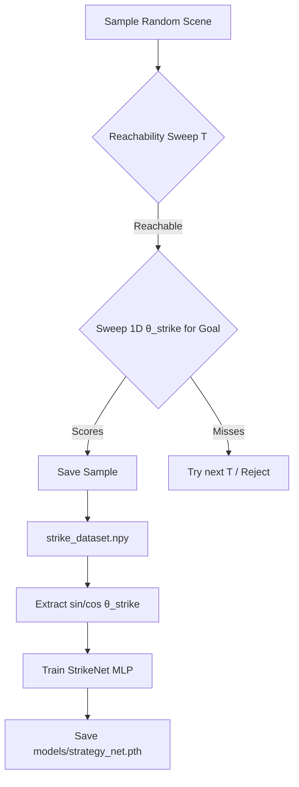
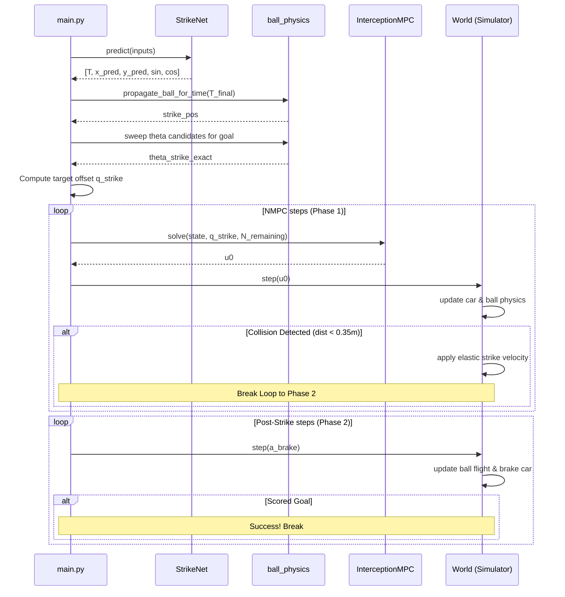

# Pipeline Logic — Phase 5 Striker

## 🖥️ Offline Pipeline: Data to Model

### 1. Data Generation (`python -m src.data_generator`)
For each sample scene:
1. Initialize random ball and car parameters.
2. For increasing $T \in [0.5, 5.0]$ s (in steps of $0.05$ s):
   - Propagate ball position $\mathbf{p}_b(T)$ using `propagate_ball_for_time` (with bounces).
   - Check if $\mathbf{p}_b(T)$ is reachable by the car under the kinodynamic bi-arc and speed profiles.
   - If reachable, perform a 1D sweep over $\theta_{strike} \in [-\pi, \pi]$ (36 candidates).
   - For each candidate, compute post-collision ball velocity $\mathbf{v}_{ball}^{post}$ with $v_{impact} = 1.0$ m/s, propagate for 5.0s, and check if it crosses the goal mouth.
   - The first $T$ and $\theta_{strike}$ that result in a goal are chosen as the training labels.
3. Save raw labels: `[ball_x, ball_y, ball_vx, ball_vy, car_x, car_y, car_theta, T_strike, x_strike, y_strike, theta_strike]`.

### 2. Training Transformation (`python -m src.network`)
To avoid discontinuities when mapping angular headings near $\pm\pi$, the training loop transforms $\theta_{strike}$ into sine and cosine components:
$$\mathbf{y}_{train} = [T_{strike}, x_{strike}, y_{strike}, \sin(\theta_{strike}), \cos(\theta_{strike})]$$
* **Architecture**: Multi-Layer Perceptron (MLP) with layer sizes `Input(7) -> 128 -> 128 -> 64 -> Output(5)`.
* **Loss**: Mean Squared Error (MSE) computed across all 5 outputs.

---

## 🏃 Online Loop: Two-Phase Execution (`main.py`)

### Phase 1: NMPC Interception
1. **StrikeNet Inference**: Maps the initial 7-D scene configuration to predicted values:
   $$\text{preds} = [T_{strike}, x_{strike\_pred}, y_{strike\_pred}, \sin(\theta_{strike}), \cos(\theta_{strike})]$$
2. **Reconstruct Angle**: $\theta_{strike\_pred} = \text{arctan2}(\sin(\theta_{strike}), \cos(\theta_{strike}))$.
3. **Horizon Steps**: Calculate discrete steps: $N_{steps} = \text{clip}(\text{round}(T_{strike} / \Delta t), 1, 50)$.
4. **Bounce Integration**: Integrate the shared physics engine up to $T_{final} = N_{steps} \Delta t$ to find the exact bounce-correct ball position $\mathbf{p}_{strike\_exact}$.
5. **Exact Angle Sweep**: Sweep candidate angles around $\theta_{strike\_pred}$ to find the exact heading $\theta_{strike\_exact}$ that directs the ball into the goal.
6. **Offset Target**: Apply $d_{offset} = 0.32$ m behind the ball center:
   $$\mathbf{q}_{strike} = \left[ x_{exact} - d_{offset}\cos(\theta_{exact}),\ y_{exact} - d_{offset}\sin(\theta_{exact}),\ \theta_{exact},\ v_{impact} \right]$$
7. **NMPC Loop**: For $k = 0 \rightarrow N_{steps} - 1$:
   - Solve NMPC using `InterceptionMPC` with horizon $N_{remaining} = N_{steps} - k$.
   - Apply first control action $u_0$.
   - If a collision is detected (`dist < 0.35` m), set `ball_struck = True` and **break** out of Phase 1 immediately.

### Phase 2: Post-Strike Coasting and Braking
1. For up to 50 steps (5.0 seconds):
   - Apply active braking acceleration to the car: $a_{brake} = \text{clip}(-v_{car} / \Delta t, -2.0, 0.0)$.
   - Propagate ball trajectory using the bounce-aware step model.
   - If the ball segment crosses the goal line ($x = 10.0$ and $y \in [2.0, 4.0]$), set `scored = True` and **break**.

---

## 🧪 Testing & Reporting Pipelines

### Integration Tests (`scripts/test_main.py`)
Runs 10 predefined seeds. Evaluates strike position and heading errors at the exact step preceding collision. Checks if the ball successfully scores, and checks that both vehicle and ball end up within the field bounds.

### Plot Generation (`scripts/generate_plots.py`)
Generates loss curves, model validation error plots, and per-seed trajectory plots. All results are written to a structured folder under `data/reports/plots/integration/{batch_id}/` where batch ID represents the timestamp of the integration test.
