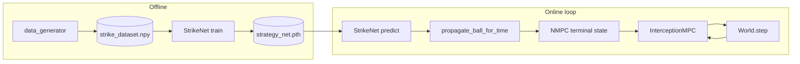

# System overview

## Problem

A **robot soccer striker** must intercept a **moving ball** on a rectangular field and arrive at the ball with a heading aimed toward the **goal**, so a subsequent kick can score. The ball may **bounce off walls**; the car must plan under kinodynamic constraints.

## Architecture

| Layer | Module | Role |
|-------|--------|------|
| Strategy | `src/network.py` — **StrikeNet** | Maps 7-D scene state → `[T_strike, x, y, θ]` (when/where to meet the ball) |
| Planning | `src/nmpc_solver.py` — **InterceptionMPC** | Shrinking-horizon NMPC; bicycle dynamics; terminal cost to strike pose |
| Simulation | `src/simulator.py` — **World** | Steps car (RK4 via MPC) and ball (shared bounce model) |
| Shared physics | `src/ball_physics.py` | Inelastic axis-aligned wall bounces — **same code** in generator, `main.py`, and `World` |
| Orchestration | `src/main.py` | Loads model, computes bounce-correct strike target, runs horizon loop |
| Layout | `src/data_layout.py` | Canonical paths for dataset, tests, runs, reports |

## State vectors

**StrikeNet input (7):** `[ball_x, ball_y, ball_vx, ball_vy, car_x, car_y, car_theta]`

**StrikeNet output (4):** `[T_strike, x_strike, y_strike, theta_strike]`  
Training labels use the **minimum feasible** interception time from geometric reachability (see [PIPELINE_LOGIC.md](PIPELINE_LOGIC.md)). At runtime, `x/y` from the network are used only to set horizon length; the **NMPC target position** is the ball position after bounce integration for `T_final`, not the raw network `(x, y)`.

**Car state (4):** `[x, y, θ, v]` — kinematic bicycle, wheelbase `L = 0.3` m.

**Ball state:** position `(x, y)` and constant velocity between bounces (no spin, no friction).

**Goal:** fixed at `(9.5, 3.0)` m unless overridden in tests.

## Phases (project history)

| Phase | Deliverable |
|-------|-------------|
| 1 | `World` + bicycle dynamics + field renderer |
| 2 | `data_generator` + `strike_dataset.npy` |
| 3 | StrikeNet + `main.py` NMPC loop + integration tests |
| 3.6 | Shared **inelastic wall bounce** (restitution 0.85); on-field labels; bounce-consistent MPC target |
| 4 | `scripts/generate_plots.py` + structured `data/reports/plots/` |

## Entry points

| Command | Purpose |
|---------|---------|
| `python -m src.data_generator` | Build training set |
| `python -m src.network` | Train / save `models/strategy_net.pth` |
| `python src/main.py --seed N --save-video` | Single demo → `data/runs/manual/...` |
| `python scripts/test_main.py` | 10-seed integration batch → `data/tests/integration/{batch}/` |
| `python scripts/generate_plots.py` | Figures from training log + chosen integration batch |

See [DATA_AND_REPORTS.md](DATA_AND_REPORTS.md) for how batch IDs link raw runs to plots.
