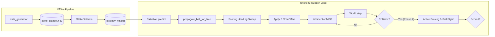

# System Overview — Phase 5 Soccer Striker

## Problem
A **robot soccer striker** must intercept a **moving, bouncing ball** on a rectangular field and redirect it into the **goal mouth** on the right wall ($x=10.0, y \in [2.0, 4.0]$). The striker must plan a path that satisfies kinodynamic constraints, intercepts the ball at the correct angle to score, and brakes to a complete stop on-pitch post-strike.

---

## Architecture

The system consists of two major components:
1. **Offline Pipeline (Imitation Learning)**: Collects reachability and scoring data, trains a multi-layer perceptron (StrikeNet) to predict when and where to meet the ball.
2. **Online Simulation Loop**: Uses StrikeNet to estimate timing, propagates the ball trajectory, sweeps for a scoring heading, applies a target offset, and runs a shrinking-horizon NMPC loop.

### Module Responsibilities

| Layer | Module | Role |
| :--- | :--- | :--- |
| **Strategy** | `src/network.py` — **StrikeNet** | MLP that maps 7-D scene state $\rightarrow$ `[T_strike, x_strike, y_strike, sin(θ), cos(θ)]`. |
| **Planning** | `src/nmpc_solver.py` — **InterceptionMPC** | Shrinking-horizon MPC using CasADi/IPOPT with pursuit-based warm-start to solve kinematic bicycle inputs. |
| **Simulation** | `src/simulator.py` — **World** | Updates car (RK4 integration) and ball (wall bounce and bumper collision). |
| **Physics** | `src/ball_physics.py` | Implements shared wall-bounce physics and car-ball elastic collision dynamics. |
| **Goal** | `src/goal.py` | Models the goal mouth geometry and checks crossing segments for scores. |
| **Orchestration** | `src/main.py` | Integrates components: queries StrikeNet, resolves scoring heading, runs NMPC and post-strike phases. |
| **Layout** | `src/data_layout.py` | Canonical paths for training logs, dataset, batches, and plots. |

---

## State Vectors & Constants

### 1. StrikeNet Input (7-D)
$$\mathbf{x}_{in} = [x_{ball}, y_{ball}, v_{x,ball}, v_{y,ball}, x_{car}, y_{car}, \theta_{car}]$$

### 2. StrikeNet Output (5-D)
$$\mathbf{y}_{out} = [T_{strike}, x_{strike}, y_{strike}, \sin(\theta_{strike}), \cos(\theta_{strike})]$$
*At runtime, $\theta_{strike}$ is reconstructed via `arctan2`.*

### 3. Car State (4-D Kinematic Bicycle)
$$\mathbf{q}_{car} = [x, y, \theta, v]^T$$
* Wheelbase $L = 0.3$ m.
* Bounds: $v \in [0.0, 2.0]$ m/s, $a \in [-2.0, 2.0]$ m/s², $\delta \in [-\pi/4, \pi/4]$ rad.

### 4. Ball State
Position $(x, y)$ and velocity $(v_x, v_y)$. Wall restitution is $e=0.85$. Car bumper restitution is $e_{strike}=0.8$.

### 5. Goal mouth
Segment along $x = 10.0$ for $y \in [2.0, 4.0]$. Center is $(10.0, 3.0)$.

---

## System Phases
* **Phase 1-3**: Interception of static/moving ball (point contact).
* **Phase 3.6**: Wall-bounce awareness (shared bounce integrator, reachability dataset filter).
* **Phase 4**: Batch-organized reporting structure (`scripts/generate_plots.py`).
* **Phase 5**: **Strike & Score** (elastic bumper collisions, goal line scoring checks, active braking, NMPC target offsets).
