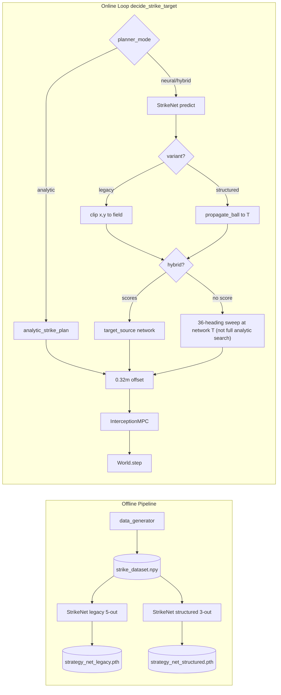

<!--
DOC PLACEHOLDERS — see docs/README.md for token definitions and how to resolve them.
-->

# System Overview — Phase 5 Soccer Striker

## Problem
A **robot soccer striker** must intercept a **moving, bouncing ball** on a rectangular field and redirect it into the **goal mouth** on the right wall ($x=10.0, y \in [2.0, 4.0]$). The striker must plan a path that satisfies kinodynamic constraints, intercepts the ball at the correct angle to score, and brakes to a complete stop on-pitch post-strike.

---

## Architecture

The system has two major components:

1. **Offline Pipeline (Imitation Learning)** — Generates reachability/scoring labels, trains **two** StrikeNet variants on the same dataset.
2. **Online Simulation Loop** — Selects a strike target via one of **three planner modes**, optionally using one of **two model variants**, then runs shrinking-horizon NMPC and post-strike braking.

Episode success requires both a car–ball strike and a goal: `success = scored AND ball_struck`.

### Planner modes (`--planner-mode`)

| Mode | Model required | Behaviour |
| :--- | :---: | :--- |
| **`analytic`** | No | Full `analytic_strike_plan()` from `src/planner.py`. `target_source = "analytic"` or `"analytic_infeasible"`. |
| **`neural`** | Yes | StrikeNet prediction used directly (no scoring guard). `target_source = "network"`. |
| **`hybrid`** | Yes | Network plan used when a scoring rollout passes; otherwise **heading-only fallback** at the network-predicted time $T$ and propagated ball position (36-heading scoring sweep — **not** a full `analytic_strike_plan` search). `target_source = "network"` or `"fallback"`. |

Implemented in `decide_strike_target()` in [`src/main.py`](../src/main.py).

### Model variants (`--model-variant`)

| Variant | Outputs | Strike position |
| :--- | :--- | :--- |
| **`legacy`** | MLP → 5 targets: $T, x, y, \sin\theta, \cos\theta$ | Predicted directly; clipped to field bounds. |
| **`structured`** | MLP → 3 targets: $T, \sin\theta, \cos\theta$ | **Derived** by `propagate_ball_for_time` to horizon $T$ (on-trajectory by construction). |

Checkpoints: `models/strategy_net_legacy.pth`, `models/strategy_net_structured.pth` (helpers in `src/data_layout.py`). `StrikeNet.load()` auto-detects variant from `output_mean` length.

### Module responsibilities

| Layer | Module | Role |
| :--- | :--- | :--- |
| **Strategy** | `src/network.py` — **StrikeNet** | MLP: 7-D scene $\rightarrow$ legacy 5-D or structured 3-D (z-scored I/O). |
| **Analytic planner** | `src/planner.py` — **`analytic_strike_plan`** | Min-$T$ search with `max_reach_distance`; offline labels, `analytic` mode, latency benchmarks. |
| **Planning** | `src/nmpc_solver.py` — **InterceptionMPC** | Shrinking-horizon CasADi/IPOPT with pursuit warm-start. |
| **Simulation** | `src/simulator.py` — **World** | RK4 car, ball bounce, bumper collision. |
| **Physics** | `src/ball_physics.py` | Wall bounce, elastic strike velocity, `propagate_ball_for_time`. |
| **Goal** | `src/goal.py` | Goal mouth geometry and segment crossing. |
| **Orchestration** | `src/main.py` | `decide_strike_target()`, NMPC loop, metadata logging, CLI flags. |
| **Layout** | `src/data_layout.py` | Paths for datasets, per-variant models, integration/comparison batches, plots. |
| **Comparison** | `scripts/compare_modes.py` | Runs 5 configs sequentially on shared seeds; writes `comparison.csv` + report. |
| **Cost/benefit analysis** | `scripts/analyze_comparison.py` | Pareto plots, win matrix, `worth_it_summary.md` from comparison metadata. |
| **Pipeline summary** | `scripts/summarize_pipeline.py` | One-page rollup after a full or partial pipeline run. |

---

## Decision latency (what we measure)

| Field | Meaning |
| :--- | :--- |
| **`decision_latency_ms`** | **Deployed path** — wall-clock of `decide_strike_target()` (30-rep median for neural/hybrid; analytic reuses its micro-benchmark). Includes inference, ball rollout, scoring checks, and hybrid fallback sweep when it fires. |
| **`fallback_sweep_ms`** | Hybrid only: time in the 36-heading sweep when `target_source = "fallback"`. |
| **`strikenet_infer_ms`**, **`analytic_strategy_ms`** | 30-rep diagnostic micro-benchmarks for scalability comparison — not the headline deployed latency. |

**Critical distinction:** hybrid fallback (~8 ms median when it fires) is **not** full analytic search (~560 ms). Fallback fixes **heading** at the network-chosen **time and ball position**; it does not re-sweep $T \in [0.5, 5.0]$ s or car reachability. That is why hybrid stays fast even when ~42% of episodes fall back.

**Typical deployed latencies** (reference run `20260613_025809`, seeds 100–199):

| Config | Median latency | Notes |
| :--- | ---: | :--- |
| analytic | ~561 ms | Full `analytic_strike_plan` |
| neural / hybrid (network path) | ~0.4–0.9 ms | Inference + rollout + one scoring check |
| hybrid (fallback path) | ~7.9 ms | + 36-heading sweep |
| pure neural | ~0.4 ms | No fallback guard |

---

## State vectors and constants

### StrikeNet input (7-D)
$$\mathbf{x}_{in} = [x_{ball}, y_{ball}, v_{x,ball}, v_{y,ball}, x_{car}, y_{car}, \theta_{car}]$$

### StrikeNet outputs

**Legacy (5-D train / 4-D predict):**
$$\mathbf{y}_{out} = [T_{strike}, x_{strike}, y_{strike}, \sin(\theta_{strike}), \cos(\theta_{strike})]$$

**Structured (3-D train / 2-D predict):**
$$\mathbf{y}_{out} = [T_{strike}, \sin(\theta_{strike}), \cos(\theta_{strike})]$$

Inputs and outputs are z-scored; `predict()` de-normalizes and reconstructs $\theta$ via `arctan2`.

### Car state (4-D kinematic bicycle)
$$\mathbf{q}_{car} = [x, y, \theta, v]^T$$
Wheelbase $L = 0.3$ m. Bounds: $v \in [0, 2.0]$ m/s, $a \in [-2.0, 2.0]$ m/s², $\delta \in [-\pi/4, \pi/4]$ rad.

### Ball and goal
Wall restitution $e=0.85$; bumper restitution $e_{strike}=0.8$. Goal: $x=10.0$, $y \in [2.0, 4.0]$.

---

## Evaluation harness

| Script | Purpose |
| :--- | :--- |
| `scripts/test_main.py` | Single-config integration batch (`--planner-mode`, `--model-variant`, `--batch-dir`). Default: hybrid + legacy, 100 seeds (100–199). |
| `scripts/compare_modes.py` | Five configs on shared seeds: analytic; neural×{legacy, structured}; hybrid×{legacy, structured}. |
| `scripts/analyze_fallback.py` | Network vs fallback breakdown (**hybrid batches only**; exits gracefully otherwise). |
| `scripts/benchmark_scalability.py` | Analytic vs network infer; hybrid fallback sweep cost; `--model-variant both`. |
| `scripts/analyze_comparison.py` | Cost/benefit report after `compare_modes.py`. |
| `scripts/summarize_pipeline.py` | Consolidated markdown summary. |

Full eval pipeline: `run_pipeline.ps1` / `run_pipeline.sh` (8 steps; light scalability benchmark by default).

---

## System phases
* **Phase 1–3**: Interception of static/moving ball.
* **Phase 3.6**: Wall-bounce awareness, reachability dataset filter.
* **Phase 4**: Batch-organized reporting (`scripts/generate_plots.py`).
* **Phase 5**: Strike & Score (elastic collisions, goal scoring, active braking, target offset).
* **Phase 5+**: Dual-model variants + 3-way planner comparison (`compare_modes.py`).
